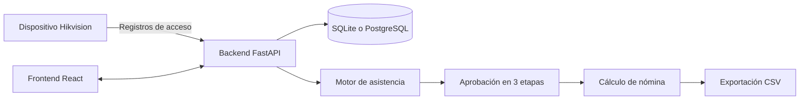

<div align="center">

# TimeLedger

### Sistema integrado de asistencia y nómina

Gestión de asistencia, aprobaciones, vacaciones, horas extra y nómina desde una sola plataforma.

[](app/backend)
[](app/frontend)
[](app/backend/requirements.txt)
[](app/frontend/package.json)

**[Guía de instalación](#instalación-en-windows)** · **[Arranque local](#configuración-y-arranque-local)** · **[API](#api-principal)** · **[GitHub](https://github.com/SOFTWARE-BANK/attendace-payment-system)**

</div>

## Visión general

TimeLedger es una aplicación web para administrar asistencia, registros de acceso, aprobaciones, vacaciones, horas extra y cálculo de nómina. Está pensada para convertir los registros de un dispositivo de control de acceso en información validada, aprobada y lista para el cálculo salarial.

### Arquitectura en una mirada



### Tecnologías

- **Backend:** API REST construida con FastAPI, SQLAlchemy y SQLite/PostgreSQL.
- **Frontend:** interfaz React con TypeScript, Vite, Tailwind CSS y shadcn/ui.
- **Documentación técnica:** [.wiki.md](.wiki.md), [.atoms/ARCHITECTURE.md](.atoms/ARCHITECTURE.md) y [.atoms/PROGRESS.md](.atoms/PROGRESS.md).

## Índice

- [Funciones principales](#funciones-principales)
- [Requisitos](#requisitos)
- [Estructura del proyecto](#estructura-del-proyecto)
- [Instalación en Windows](#instalación-en-windows)
- [Configuración y arranque local](#configuración-y-arranque-local)
- [Prueba rápida](#prueba-rápida-con-datos-de-demostración)
- [API principal](#api-principal)
- [Comandos del frontend](#comandos-del-frontend)
- [Base de datos y seguridad](#base-de-datos)
- [Solución de problemas](#solución-de-problemas)

## Funciones principales

| Módulo | Qué resuelve |
|---|---|
| Asistencia | Convierte registros de entrada/salida en jornadas liquidadas. |
| Aprobaciones | Gestiona el circuito responsable de asistencia -> gerente -> CEO. |
| Vacaciones | Registra solicitudes, aprobaciones y saldos disponibles. |
| Horas extra | Acumula, convierte a vacaciones y compensa retardos. |
| Nómina | Calcula periodos semanales, quincenales o mensuales y exporta CSV. |
| Internacionalización | Permite alternar la interfaz entre coreano y español. |

## Requisitos

- Python 3.11 o posterior.
- Node.js 20 o posterior.
- npm o pnpm.
- Git.

No es necesario instalar PostgreSQL para una prueba local: el backend puede utilizar SQLite.

## Estructura del proyecto

```text
.
├── app/
│   ├── backend/
│   │   ├── core/              # Configuración, autenticación y base de datos
│   │   ├── models/            # Modelos ORM
│   │   ├── routers/           # Endpoints REST
│   │   ├── services/          # Lógica de asistencia, aprobaciones y nómina
│   │   ├── mock_data/         # Datos iniciales de demostración
│   │   ├── requirements.txt   # Dependencias Python
│   │   └── main.py            # Aplicación FastAPI
│   ├── frontend/
│   │   ├── src/
│   │   │   ├── components/    # Componentes compartidos
│   │   │   ├── pages/         # Pantallas de la aplicación
│   │   │   └── lib/           # API, tipos e internacionalización
│   │   ├── package.json
│   │   └── vite.config.ts
│   └── start_app_v2.sh        # Arranque automatizado para Linux/macOS
├── .gitignore
└── README.md
```

## Instalación en Windows

Abre dos terminales de PowerShell en la carpeta del proyecto. El backend y el frontend se ejecutan como procesos independientes.

> **Nota:** en este entorno se usa `npm.cmd` porque PowerShell puede bloquear el wrapper `npm.ps1`.

### 1. Preparar el backend

```powershell
Set-Location ".\app\backend"
python -m venv .venv
.\.venv\Scripts\python.exe -m pip install --upgrade pip
.\.venv\Scripts\python.exe -m pip install -r requirements.txt
```

### 2. Preparar el frontend

En otra terminal:

```powershell
Set-Location ".\app\frontend"
npm.cmd install
```

El proyecto conserva `pnpm-lock.yaml`; si prefieres pnpm, usa `pnpm install` en lugar de `npm.cmd install`.

## Configuración y arranque local

> **Resultado esperado:** API en `http://127.0.0.1:8000` y aplicación web en `http://127.0.0.1:3000`.

### Backend

Desde `app/backend`, define las variables de desarrollo e inicia FastAPI:

```powershell
Set-Location ".\app\backend"
$env:DATABASE_URL = "sqlite:///./attendance.db"
$env:JWT_SECRET_KEY = "cambia-esta-clave-en-produccion"
$env:JWT_ALGORITHM = "HS256"
$env:ADMIN_USER_ID = "local-admin"
$env:ADMIN_USER_EMAIL = "admin@local.test"
$env:ENVIRONMENT = "dev"
$env:IS_LAMBDA = "false"
.\.venv\Scripts\python.exe -m uvicorn main:app --host 127.0.0.1 --port 8000
```

El backend estará disponible en:

- API: http://127.0.0.1:8000
- Salud: http://127.0.0.1:8000/health
- Swagger/OpenAPI: http://127.0.0.1:8000/docs

### Frontend

Desde `app/frontend`, inicia Vite en la segunda terminal:

```powershell
Set-Location ".\app\frontend"
$env:BACKEND_PORT = "8000"
npm.cmd run dev -- --host 127.0.0.1 --port 3000
```

Abre http://127.0.0.1:3000 en el navegador.

El archivo `vite.config.ts` reenvía las solicitudes `/api` al backend configurado en `BACKEND_PORT`.

## Prueba rápida con datos de demostración

La demostración permite comprobar el flujo completo sin conectar un dispositivo Hikvision real.

1. Abre el frontend.
2. En el dashboard, usa la acción de preparación de datos de demostración.
3. La aplicación creará registros de acceso y ejecutará la liquidación de asistencia.
4. Revisa las pantallas de asistencia, aprobaciones, vacaciones, horas extra y nómina.
5. Para reiniciar únicamente los datos transaccionales de demostración, utiliza el endpoint `POST /api/v1/attendance/reset_demo`.

Los datos maestros de empleados, motivos y saldos se conservan al reiniciar las transacciones.

## API principal

La documentación interactiva completa está disponible en `/docs`. Las rutas más importantes son:

| Área | Endpoint base | Uso |
|---|---|---|
| Salud | `/health` | Comprobar disponibilidad del servidor |
| Autenticación | `/api/v1/auth` | Inicio y gestión de sesión |
| Asistencia | `/api/v1/attendance` | Carga, liquidación, ajustes y dashboard |
| Entidades | `/api/v1/entities/*` | Consulta y modificación de datos maestros |
| Aprobaciones | `/api/v1/attendance/approval/*` | Envío, aprobación y rechazo |
| Nómina | `/api/v1/attendance/payroll/*` | Cálculo de nómina |
| Configuración | `/api/v1/admin/settings` | Configuración administrativa |

## Comandos del frontend

Ejecuta estos comandos desde `app/frontend`:

```powershell
npm.cmd run dev       # Servidor de desarrollo
npm.cmd run build     # Compilación de producción
npm.cmd run lint      # Revisión de ESLint
npm.cmd run preview   # Previsualización del build
```

## Base de datos

Para desarrollo local se recomienda:

```text
DATABASE_URL=sqlite:///./attendance.db
```

Para producción, configura una URL de PostgreSQL compatible con SQLAlchemy, por ejemplo `postgresql://...`. El backend adapta automáticamente el controlador a `asyncpg`.

La base local, los logs, los entornos virtuales, `node_modules`, los archivos `.env` y los builds están excluidos mediante `.gitignore`.

## Seguridad

- No subas archivos `.env`, tokens, claves privadas ni bases de datos con información real.
- Usa una clave `JWT_SECRET_KEY` segura y única en producción.
- Configura `ADMIN_USER_ID` y `ADMIN_USER_EMAIL` con los valores reales del entorno.
- Revisa los permisos del flujo de aprobación antes de usar el sistema con datos reales.

## Solución de problemas

### El backend falla indicando que falta `DATABASE_URL`

Define la variable antes de iniciar Uvicorn. En PowerShell, las variables se establecen con `$env:NOMBRE = "valor"`.

### El frontend no puede consultar la API

Comprueba que el backend está activo en el puerto 8000 y que `$env:BACKEND_PORT` coincide con ese puerto antes de iniciar Vite.

### `npm` aparece bloqueado por PowerShell

Usa `npm.cmd` en lugar de `npm`, como en los comandos de esta guía, o ejecuta PowerShell con una política de ejecución adecuada para tu entorno.

### El script `start_app_v2.sh` no funciona en Windows

Ese script está escrito para Bash. En Windows, utiliza los comandos PowerShell de esta guía o ejecútalo desde WSL/Git Bash con sus dependencias disponibles.

## Estado actual

El proyecto se publica en:

https://github.com/SOFTWARE-BANK/attendace-payment-system

La documentación técnica detallada está disponible en [.wiki.md](.wiki.md) y [.atoms/ARCHITECTURE.md](.atoms/ARCHITECTURE.md).
